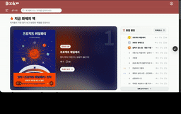
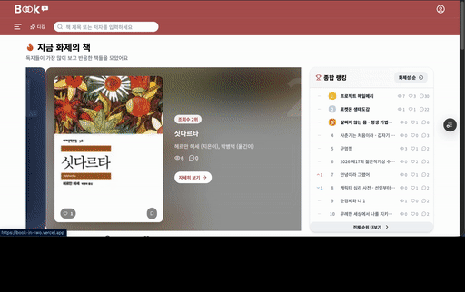
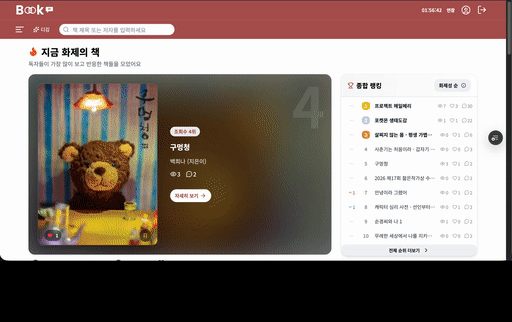
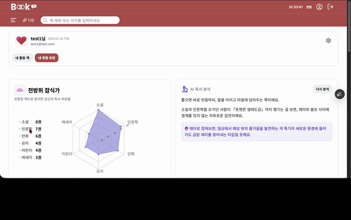

# 📚 책 In (BookIn)

> 알라딘 OpenAPI 기반 도서 탐색·커뮤니티에 조회수·랭킹과 AI 개인화 추천을 결합한 풀스택 웹 서비스

🔗 **Live**: [book-in-two.vercel.app](https://book-in-two.vercel.app/)



<details>
<summary>📸 스크린샷 더보기</summary>

<br/>

|                AI 디깅                |        AI 추천 / 취향 리포트         |       상세(댓글·좋아요·북마크)       |
| :-----------------------------------: | :----------------------------------: | :----------------------------------: |
|  |  |  |

</details>


---

## 프로젝트 소개

책을 **찾고(탐색) → 반응하고(좋아요·북마크·댓글) → 추천받는(AI)** 과정을 한 곳에서 끝내는 도서 커뮤니티입니다. 흩어진 베스트셀러·신간·리뷰·"내가 본 책"을 한 서비스에 모아, 탐색부터 개인 서재 관리, 다음 책 추천까지 이어지도록 설계했습니다.

- **탐색** - 카테고리, 베스트셀러, 신간 조회수 TOP, 종합 랭킹
- **기록** - 좋아요,북마크(+메모,태그), 댓글로 나만의 서재
- **추천** - AI 개인화 추천(임베딩 벡터검색) + 선택형 문답 디깅

## ⏳ 제작 기간

- 팀 MVP: 2024.07.08 ~ 07.14 (1주, FE 5명)
- 개인 리팩토링·기능 확장: 2026.03 ~ 현재

---
## 📑 주요 기능

### 🏠 메인
- 베스트셀러·신간 진열
- **조회수 TOP5 무한 슬라이드** · **종합 랭킹보드**(가중합 점수, 전일 대비 ▲▼NEW)
- **최근 본 책** · **조건별 검색**
- SSR + TanStack Query prefetch로 초기 진입 최적화

### 🔎 검색 / 카테고리
- **검색어·조건 기반 도서 검색**(`/search`) — 헤더 자립 검색바에서 진입
- 카테고리: QueryType(베스트셀러·신간·블로그베스트 등) / Target(국내·외서·eBook) 전환 + 페이지네이션

### 📖 상세
- 도서 정보(가격·표지·소개·구매 링크)
- 댓글 CRUD(낙관적 업데이트) · 좋아요 · 북마크(+메모·태그)
- 진입 시 최근 본 책 자동 기록

### 🤖 AI 기능
- **개인화 추천** — 좋아요·북마크 취향을 임베딩해 벡터 검색(pgvector)으로 유사 도서 추천
- **AI 디깅** — 선택형 문답으로 취향을 파낸 뒤 임베딩 검색으로 책 추천 (비회원 하루 1회 → 회원가입 유도)
- **취향 리포트** — 활동 데이터를 차트·persona로 시각화 + AI 한 줄 분석

### 👤 마이페이지 / 인증
- myBooks: 좋아요·북마크·댓글 탭별 **검색·정렬·필터** 통합
- 계정 설정(별도 settings): 이메일(아이디)·비밀번호·닉네임·아바타 변경, 탈퇴
- Supabase Auth 로그인/회원가입/이메일 인증 + **소셜 로그인** + 메일 토큰 기반 비밀번호 재설정

---

## 🛠 기술 스택

### Frontend

<div align='left'>


</div>

### State / Data

<div align='left'>


</div>

### Backend / Infra

<div align='left'>


</div>

### AI / 추천

<div align='left'>


</div>

- **LLM**: Claude Haiku 4.5 — structured output(JSON 강제), 서버 라우트 전용(클라 번들 영향 0)
- **임베딩·벡터검색**: gte-small(384차원) + pgvector(HNSW) — Supabase Edge Functions로 임베딩 생성
- **검증**: Zod — AI 응답·폼 런타임 검증

### Editor / Utilities

- **에디터**: Tiptap v3 (StarterKit + Placeholder)
- **HTML sanitize**: DOMPurify, sanitize-html
- **메일**: Nodemailer (비밀번호 재설정 / 이메일 인증)
- **유틸**: dayjs, uuid, lucide-react
- **빌드 분석**: @next/bundle-analyzer

### Test

<div align='left'>


</div>

---

## 🔩 프로젝트 구조

의존 방향을 한쪽으로만 흐르게 설계했습니다: **UI → 훅 → 도메인/어댑터** (역방향 없음). 비즈니스 규칙은 React·Next에 의존하지 않는 `shared/domain`에 격리해, 테스트·재사용이 프레임워크와 무관하도록 했습니다.

- **`app/`** — 라우팅·페이지 셸·서버 컴포넌트 / Route Handler (라우트별 종속 컴포넌트는 `_components/`)
- **`components/`** — 라우트와 무관하게 재사용하는 UI
- **`hooks/`** — 도메인별 React 훅 (`useXxxQuery` / `useXxxMutation` — TanStack Query 통합)
- **`shared/domain/`** — 비즈니스 규칙·도메인 모델 (UI·프레임워크 비의존)
- **`shared/lib/`** — Supabase·메일·암호화·**추천 레일(rails)** 등 외부 시스템 어댑터
- **`stores/`** — Zustand 전역 상태 (검색·필터·UI)

---

## 🚀 시작하기

### 환경 변수 (`.env.local`)

```env
# Supabase
NEXT_PUBLIC_SUPABASE_URL=...
NEXT_PUBLIC_SUPABASE_ANON_KEY=...      # publishable 키
SUPABASE_SERVICE_ROLE_KEY=...          # secret 키 (RLS 우회, 서버 전용)

# 외부 API
ALADIN_TTB_KEY=...
ANTHROPIC_API_KEY=...                  # AI 추천·디깅

# 메일 (Nodemailer + 네이버 SMTP)
NAVER_EMAIL=...
NAVER_EMAIL_PASSWORD=...

# 보안 · 운영
IP_HASH_SECRET=...                     # 조회수 dedup HMAC
CRON_SECRET=...                        # Vercel Cron(랭킹 스냅샷) 인증
ADMIN_BUILD_TOKEN=...                  # 임베딩 색인 라우트 보호
```

### 스크립트

```bash
yarn dev          # 개발 서버
yarn build        # 프로덕션 빌드
yarn start        # 빌드 결과 실행
yarn lint         # ESLint
yarn test         # vitest watch
yarn test:run     # vitest 1회 실행 (CI)
yarn test:ui      # vitest UI
yarn genTypes     # supabase 스키마 → TypeScript 타입 생성
```

---

## 🧪 테스트 전략

- **단위 / 통합**: Vitest + React Testing Library — 훅·도메인 순수함수·컴포넌트·**API 라우트**까지 계층별 커버 (`__tests__/`)
- **API 모킹**: MSW — 네트워크 의존 없이 훅/라우트 테스트
- **타입 안전성**: Supabase 스키마 → TypeScript 타입 자동 생성(`yarn genTypes`)으로 DB-코드 불일치를 컴파일 타임에 차단

---

## 🛠 트러블슈팅 (대표 사례)

<details>
<summary><b>1. 댓글 수정 / 삭제 시 화면 즉시 반영 안 됨</b></summary>

- **원인**: invalidate 후 refetch 타이밍과 사용자 체감 사이의 간극
- **조치**: TanStack Query 낙관적 업데이트(`onMutate` → `setQueryData`) 적용 + Pagination total 카운트까지 일관성 유지

</details>

<details>
<summary><b>2. 마이페이지 ID 수정 시 값이 잘려서 저장</b></summary>

- **원인**: `useState` + `setTimeout` 조합과 `onAuthStateChange` 비동기 흐름이 맞물려 입력값이 일부만 반영
- **조치**: 입력값을 `useRef`로 관리해 리렌더 타이밍 영향 제거

</details>

<details>
<summary><b>3. 도서 이미지 LCP 지연</b></summary>

- **원인**: 외부 도메인 이미지 + 일반 `` 태그
- **조치**: `next/image` 전환 + `priority` / `sizes` 지정, 카테고리 페이지 첫 화면 이미지 우선 로드

</details>

<details>
<summary><b>4. 폰트로 인한 CLS</b></summary>

- **원인**: 외부 CDN CJK 폰트 로드 지연
- **조치**: `next/font` self-host로 전환, preload + display swap 전략 적용

</details>

<details>
<summary><b>5. Supabase Route Handler 500 에러</b></summary>

- **원인**: `request.json()` 미사용 + 잘못된 환경변수 형식
- **조치**: `.env.local` URL/Key 형식 교정, `NextResponse.json()` 명시적 반환으로 정리

</details>

<details>
<summary><b>6. 알라딘이 신뢰할 total을 안 줌 → 마지막 페이지 계산 시 배포 504</b></summary>

- **원인**: 알라딘 `totalResults`가 부정확 + 경계 probe 순차 호출이 RSC에 묶여 배포 타임아웃
- **조치**: 지수+이진 탐색으로 경계 확정(O(log n)), `unstable_cache` 캐싱, `maxDuration` 상향

</details>

<details>
<summary><b>7. 배포에서만 느린 목록 탭 전환 / 페이지 이동</b></summary>

- **원인**: 전환마다 무거운 RSC가 캐시 없이 재실행 + 엣지에서 알라딘 레이턴시 증폭
- **조치**: shallow(`replaceState`) 임시 대응 → `useQuery` + `pushState` 히스토리 복원 + 인접 페이지 prefetch로 재설계

</details>

<details>
<summary><b>8. AI 디깅 "책 찾기"가 배포에서 504 (로딩 후 결과 없음)</b></summary>

- **원인**: Anthropic + embed + match_book 순차 처리가 Vercel 기본 10초 초과 → 함수 강제 종료
- **조치**: 라우트에 `export const maxDuration = 60` 지정

</details>

<details>
<summary><b>9. 카테고리 필터 벡터검색 시 결과가 텅 빔 (HNSW)</b></summary>

- **원인**: HNSW가 근접 탐색을 먼저 하고 필터를 나중에 적용 → 앞 결과가 다 걸러지면 빈 결과
- **조치**: 후보를 `materialized CTE`로 먼저 물질화한 뒤 그 안에서 검색

</details>

<details>
<summary><b>10. AI 응답 zod 검증에서 500 (enum + 개수 제한)</b></summary>

- **원인**: `z.array(z.enum(목록)).min(2).max(3)` — AI가 목록 밖 값을 주거나 개수(2~3)를 어기면 통째로 실패
- **조치**: `z.array(z.string())`로 완화 + 라우트에서 화이트리스트 교집합, 하나도 없으면 전체 검색 폴백

</details>

<details>
<summary><b>11. 디깅 진행상태가 날짜 지나도 안 지워짐</b></summary>

- **원인**: 결과는 날짜 만료되는데 "풀던 문제"엔 날짜 가드가 없어 어제 문항이 복원됨
- **조치**: 저장·복원 양쪽에 KST 날짜 확인 통일

</details>

---

## 📌 진행 중 / 예정

- [ ] 관련 도서 추천 레일 (검색어·상세 기반, 공용 컴포넌트)
- [ ] 카테고리 "새로운 발견" 레일 (현재 카테고리 제외 추천)
- [ ] E2E 테스트 도입 (Playwright)
- [ ] 대화형 AI 어시스턴트
